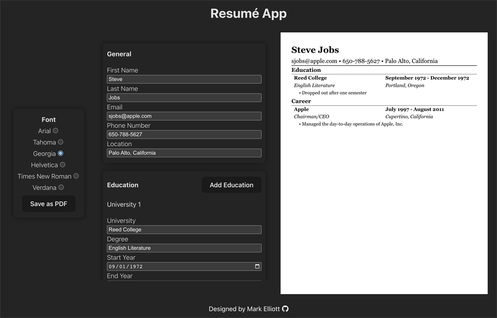

Site is currently deployed [here](https://mark-elliott5-cv-app-2.netlify.app/). 

This Resume project features:
* React front-end development with PropTypes
* Key generation and assignment with UUID
* PDF generation with html2pdf to save and print resumes
* Vite
* Netlify deployment

